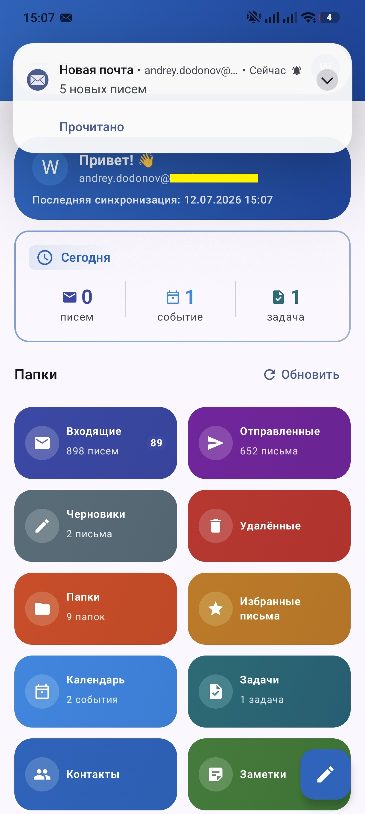
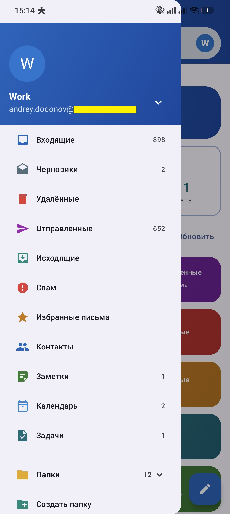
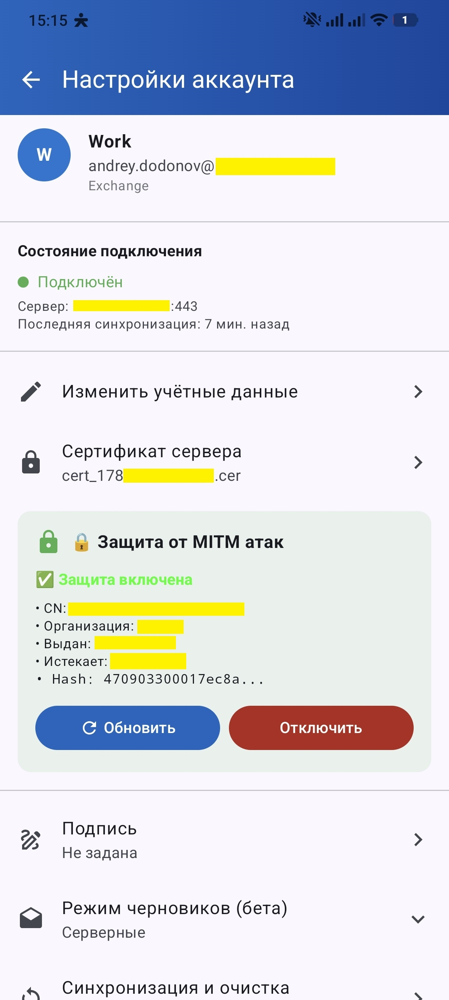
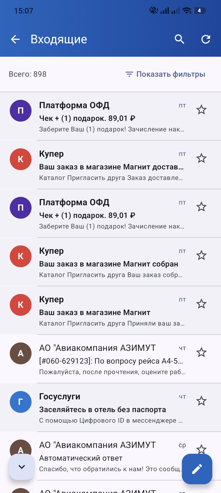
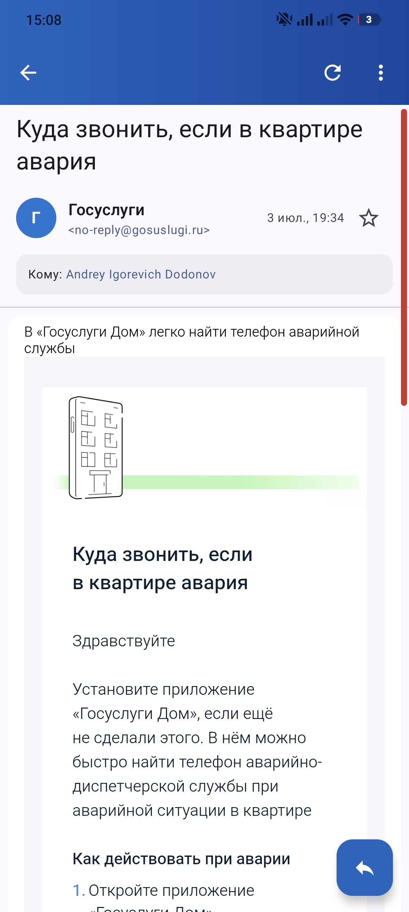
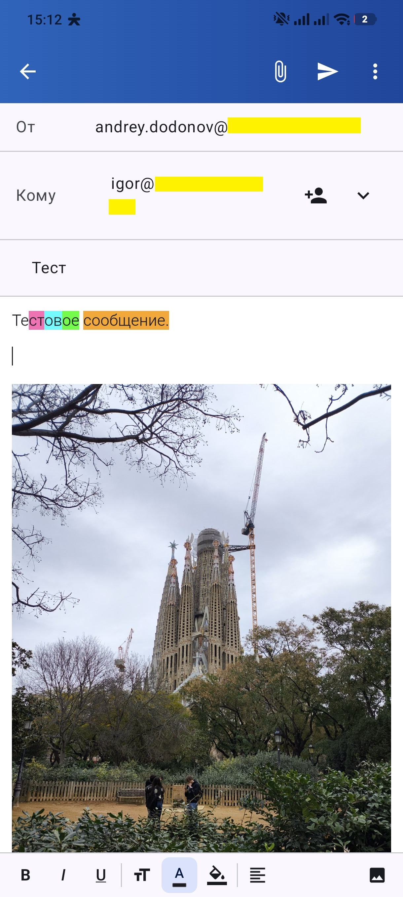
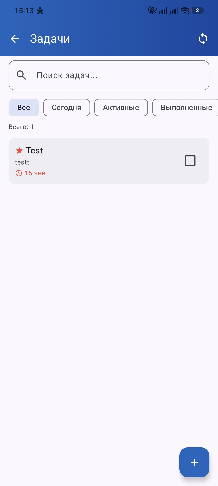
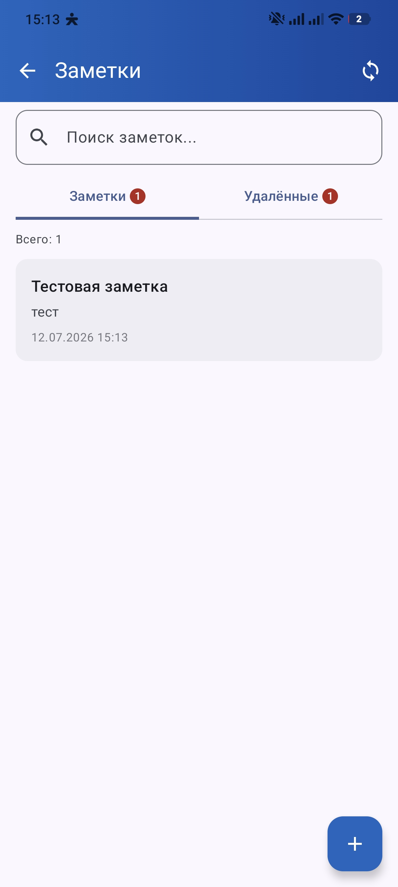
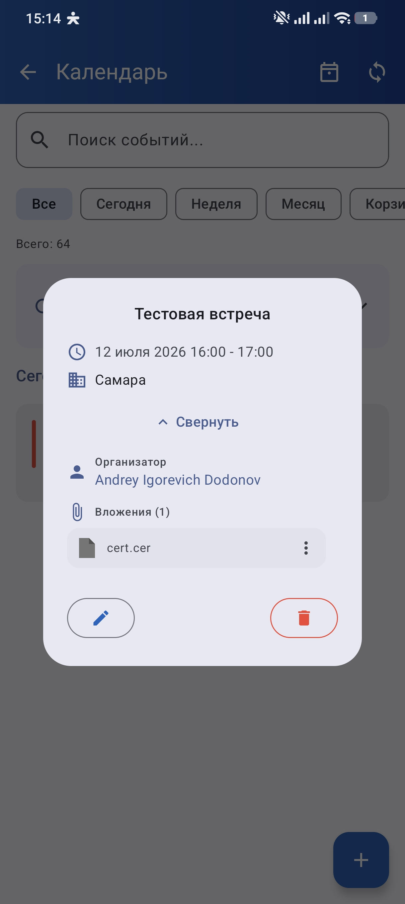
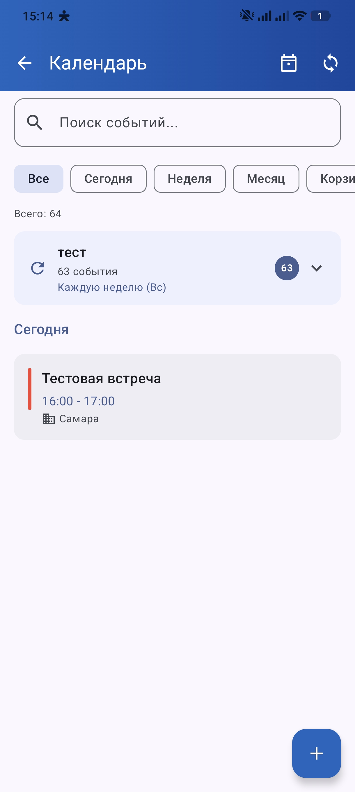

# iwo Mail Client

🇬🇧 [English version](README_EN.md)

[](https://github.com/DedovMosol/IwoMailClient/actions/workflows/ci.yml)
[](https://github.com/DedovMosol/IwoMailClient/releases)
[](LICENSE)


Почтовый клиент для Android с основным фокусом на Microsoft Exchange Server 2007 SP1+ через Exchange ActiveSync и EWS. IMAP/POP3 присутствуют как beta-направление с ограниченной функциональностью.

**Версия:** 1.6.3b
**Пакет:** `com.dedovmosol.iwomail`
**Разработчик:** DedovMosol
**Telegram:** [@i_wantout](https://t.me/i_wantout)
**Email:** andreyid@outlook.com

## Текущее состояние проекта

- **Production-фокус:** Exchange 2007 SP1/SP2 и совместимые on-premise Exchange-серверы.
- **Основной протокол:** EAS 12.0/12.1/14.0/14.1 для почты, папок, контактов, Direct Push и части операций.
- **EWS-дополнение:** календарь, задачи, заметки, черновики, вложения календаря, ответы на встречи и fallback-сценарии для Exchange 2007.
- **Auth:** Basic Auth; для EWS-операций дополнительно NTLMv2-fallback. EAS-транспорт работает только с Basic Auth. OAuth 2.0 / Modern Auth пока не реализованы.
- **Локальная модель:** offline-first через Room DB, UI читает данные через Flow, фоновые сервисы обновляют базу.

## Возможности

- **Почта:** синхронизация системных и пользовательских папок, отправка HTML-писем, вложения, inline-изображения, CC/BCC, важность, поиск, фильтры, избранное, мультивыбор, batch-операции.
- **Черновики:** серверный режим через Exchange/EWS и локальный beta-режим, выбор режима в онбординге и настройках аккаунта.
- **Отправка:** отложенная отправка, очередь исходящих для offline-сценариев, undo-send, MDN/DSN-запросы.
- **Контакты:** локальные и Exchange-контакты, GAL, группы, избранное, импорт/экспорт vCard/CSV, автодополнение адресов.
- **Календарь:** события, встречи, участники, ответы на приглашения, повторения, исключения, напоминания, вложения, онлайн-ссылки, локальная корзина, окончательное удаление только после подтверждения сервера.
- **Задачи:** активные/выполненные/важные/просроченные задачи, сроки, приоритеты, назначение, напоминания, корзина и восстановление.
- **Заметки:** синхронизация Exchange Notes, создание/редактирование, корзина и восстановление.
- **Уведомления:** Direct Push через EAS Ping, WorkManager-синхронизация, AlarmManager fallback, уведомления писем, календаря, задач, обновлений и исходящих.
- **Интерфейс:** Jetpack Compose, Material 3, RU/EN локализация, тёмная/светлая тема, цветовые схемы, ежедневные темы, кастомные иконки файлов, drag selection.
- **Виджет и shortcuts:** домашний виджет Glance, быстрый доступ к письмам, поиску, календарю, задачам и созданию письма; данные виджета читаются лёгкими Room-проекциями без загрузки тяжёлых тел писем/событий.
- **Обновления:** проверка `update.json` на GitHub, выбор APK по ABI, скачивание, установка и подготовка отката.

## Скриншоты

| | | |
|:-:|:-:|:-:|
|  |  |  |
|  |  |  |
|  |  |  |
|  | | |

## Требования

| Параметр | Минимум | Рекомендуется |
|----------|---------|---------------|
| Android | 8.0+ (API 26) | — |
| RAM | 2 ГБ | 4+ ГБ |
| Свободное место | 50 МБ | 100+ МБ |
| CPU/ABI | armeabi-v7a / x86 | arm64-v8a / x86_64 |

- **Compile SDK:** 36
- **Target SDK:** 36
- **Java/Kotlin target:** JVM 17
- **APK:** universal + ABI splits для `armeabi-v7a`, `arm64-v8a`, `x86`, `x86_64`
- **Сборка:** требуется JDK 17 (минимум JDK 11 для Android Gradle Plugin 8.7.3)

## Поддерживаемые серверы

| Сервер | Статус |
|--------|--------|
| Exchange 2007 SP1/SP2 | Стабильный основной сценарий |
| Exchange 2010/2013/2016 on-premise | Архитектурно поддерживается через EAS/EWS, требует проверки на конкретной инфраструктуре |
| Office 365 / Exchange Online | Ограничено: требуется OAuth/Modern Auth, который пока не реализован |
| IMAP/POP3 | Beta: чтение/синхронизация через JavaMail, без полного parity с Exchange |

## Календарь и вложения

- **DRY для повторяющихся событий:** вложения календаря хранятся как JSON-метаданные (`fileReference`, имя, размер), а не как копии файлов для каждого occurrence.
- **Exchange 2007 SP1:** загрузка/получение вложений календаря идёт через EWS `CreateAttachment`/`GetItem`; для recurring-серий используется master ItemId.
- **Окончательное удаление:** локальное удаление из БД выполняется только после успешного удаления на сервере; операции сериализованы с календарной синхронизацией per-account mutex.
- **Защита от CRA resurrection:** attendee-встречи перед удалением отклоняются через `MeetingResponse`/EWS `DeclineItem`; если исходный meeting request не найден, локальное удаление не выполняется.
- **Preview cache:** предпросмотр вложений использует временный каталог `cacheDir/calendar_preview`, стабильные имена по `fileReference` и отложенную очистку без гонок с внешними просмотрщиками.

## Виджет и производительность

- **Лёгкие DAO-проекции:** виджет читает только отображаемые поля для последних непрочитанных писем, ближайшей задачи и события календаря.
- **Корректная логика непрочитанных:** список новых писем в виджете фильтруется по Inbox и `read = 0`.
- **Защита от гонок:** `updateMailWidget()` сериализует `GlanceAppWidget.updateAll()` через общий mutex и использует `applicationContext`.
- **Адаптивная раскладка:** нижний ряд действий подстраивается под ширину виджета (Glance `Row` не переносит содержимое) — на узких размерах меньше аватаров и без метки времени синхронизации, чтобы кнопки не обрезались; аватары масштабируются вместе с виджетом.
- **Room v42:** добавлены индексы под горячие widget-запросы: unread Inbox, тип папки, активные задачи, текущие и ближайшие события календаря.

## Безопасность и совместимость

- **Conscrypt:** добавлен для TLS 1.0/1.1 и совместимости со старыми Exchange 2007-инсталляциями.
- **Сертификаты сервера:** поддержка системных, пользовательских и самоподписанных сертификатов.
- **mTLS:** клиентские сертификаты PKCS#12 (`.p12`/`.pfx`) с кэшированием KeyManager.
- **Certificate Pinning:** хранение SHA-256, CN/O и дат сертификата в аккаунте.
- **Пароли:** `EncryptedSharedPreferences`, fallback на обфусцированное хранилище при недоступности Keystore.
- **Alternate URL:** основной и резервный URL Exchange с fallback при сетевых ошибках и последующим auto-switchback.
- **XSS-защита тел писем:** `sanitizeEmailHtml` блокирует `<script>`, plugin-контейнеры (`iframe`/`object`/`embed`/`applet`), event-handlers, `meta http-equiv="refresh"`, `javascript:` и `data:text/html` URI во всех атрибутах с URL-контекстом. Комбинируется с `loadDataWithBaseURL(null, ...)` в WebView для изоляции от cross-origin контекста.

## Известные ограничения

- **OAuth 2.0 / Modern Auth:** не поддерживается.
- **Office 365:** без Basic Auth обычно не работает.
- **NTLM для EAS:** EAS-транспорт поддерживает только Basic Auth (NTLMv2 применяется только к EWS-операциям); виртуальный каталог `/Microsoft-Server-ActiveSync` должен разрешать Basic Auth.
- **IMAP/POP3:** beta-реализация, не покрывает календарь, контакты, задачи, заметки, Direct Push и EWS-функции.
- **S/MIME:** подписи и шифрование не реализованы.
- **EAS 16.x:** явно не является целевой версией проекта; основной диапазон в коде — EAS 12.x-14.1.

## Технологический стек

| Категория | Технологии |
|-----------|------------|
| Kotlin | Kotlin 1.9.22, Java 17 |
| Android | AGP 8.7.3, minSdk 26, targetSdk 36 |
| UI | Jetpack Compose, Compose BOM 2024.06.00, Material 3 |
| Асинхронность | Coroutines 1.7.3, Flow |
| Хранилище | Room 2.6.1 (`MailDatabase` v42), DataStore Preferences |
| Сеть | OkHttp 4.12.0, Conscrypt 2.5.2 |
| Протоколы | EAS, EWS, JavaMail IMAP/POP3 |
| Фоновые задачи | WorkManager 2.9.0, Foreground Service, AlarmManager |
| Безопасность | AndroidX Security Crypto, TLS/mTLS, Certificate Pinning |
| UI extras | Coil, Glance AppWidget |
| DI | Manual DI через `RepositoryProvider` |

## Архитектура кратко

```text
UI Layer
  Jetpack Compose, Navigation, Theme, Localization
  MainScreen, Setup/Verification, Mail, Compose, Contacts, Calendar, Notes, Tasks, Updates
    ↓
Repository Layer
  AccountRepository, MailRepository, CalendarRepository, ContactRepository,
  NoteRepository, TaskRepository, SettingsRepository, AccountServerHealthRepository
  EmailSyncService, EmailOperationsService, FolderSyncService, AppFileCleanupService
    ↓
Protocol Layer
  EasClient facade
  EasTransport + EAS services + EWS client + IMAP/POP3 beta clients
    ↓
Persistence / Network
  Room MailDatabase v42, DataStore
  HttpClientProvider, NetworkMonitor, NtlmAuthenticator
    ↓
Background
  PushService, SyncWorker, OutboxWorker, reminders, notifications, watchdogs
```

Подробно: [Архитектура проекта](docs/ARCHITECTURE.md)

## Сборка

Рекомендуемый production-способ сборки — через Android Studio с JDK 17. CLI-команды ниже подходят как вспомогательный вариант при корректно настроенном `JAVA_HOME`.

```bash
./gradlew assembleDebug
./gradlew assembleRelease
```

На Windows можно использовать:

```powershell
.\gradlew.bat assembleDebug
.\gradlew.bat assembleRelease
```

## Документация

- [История изменений RU](docs/CHANGELOG_RU.md)
- [История изменений EN](docs/CHANGELOG_EN.md)
- [Архитектура проекта](docs/ARCHITECTURE.md)
- [Политика конфиденциальности](docs/PRIVACY_POLICY.md)
- [План миграции XML-парсинга](docs/XMLPULLPARSER_MIGRATION_PLAN.md)

## Важно: переименование пакета

Версия 1.6.1 изменила пакет с `com.iwo.iwomail` на `com.dedovmosol.iwomail`.

- Обновление старых APK как обычный апдейт невозможно: Android считает это другим приложением.
- Нужна переустановка: удалить старую версию, установить новую и заново добавить аккаунты.
- Перед переходом со старого пакета рекомендуется экспортировать локальные контакты/данные.

## Обратная связь

- **Telegram:** [@i_wantout](https://t.me/i_wantout)
- **Email:** andreyid@outlook.com
- **Issues:** [GitHub Issues](https://github.com/DedovMosol/IwoMailClient/issues)

## Лицензия

MIT License

---

© 2025-2026 DedovMosol
